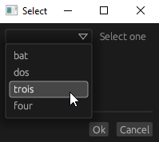

# CLIALOGS

**C**ommand **L**ine d**IALOGS**

## Usage

clialogs [--icon-path <ICON_PATH>] <COMMAND> <COMMAND_ARGUMENTS>

The `--icon-path` argument is optional and it is the path of the icon to show in the window and the taskbar

All command have the same output format, which is printed in stdout when the dialog closes:


```json
{
    "type": "ok", // or "cancel"
    "body": [
        {
            "id": "id_of_the_field",
            "value": "value_of_the_field"
        }
    ]
}
```

## Commands

There are the available commands

* [Notification](#notification)
* [File-dialog](#file-dialog)
* [Message-dialog](#message-dialog)
* [Input](#input)
* [Progress](#progress)
* [Log-in](#log-in)
* [Calendar](#calendar)
* [Color](#color)
* [List](#list)
* [Select](#select)
* [Custom](#custom)

### Notification

```
notification  Notification
    --title     <TITLE>      Title of the notification
    --text      <TEXT>       Text of the notification
```
Example: `clialogs notification --title "Title" --text "Text of notification"`

---

### File-dialog

```
file-dialog   File/Directory selection dialog
    --directory  Flag for directory selection
    --multiple   Flag for multiple selection
    --save       Flag to be a save dialog
```
Example: `clialogs file-dialog --directory --multiple`

Example output:

```json
{
    "type": "ok",
    "body": [
        {
            "id": "paths",
            "value": "[/path/to/selected/directory,/path/to/selected/directory2]"
        }
    ]
}
```

---

### Message-dialog

```
message-dialog  Message dialog
    --title     <TITLE>  Title of the window
    --level     <LEVEL>  Dialog level [default: info] [possible values: info, warning, error, question]
    --text      <TEXT>   Text of the dialog
```
Example: `clialogs message-dialog --title "tERRRRROOOOORRR" --text "It's fine" --level error`

Example output:

```json
{
    "type": "ok",
    "body": []
}
```

---

### Input

```
input         Input with a label
    --title     <TITLE>     Title of the window
    --label     <LABEL>     Label of the input
    --hint      <HINT>      Hint text of the input
```
Example: `clialogs input --title "Title" --label "write text please"`


Example output:

```json
{
    "type": "ok",
    "body": [
        {
            "id": "input",
            "value": "Input text"
        }
    ]
}
```

---

### Progress

```
progress         Progress dialog
    --title     <TITLE>     Title of the window
    --label     <LABEL>     Label of the progress
```
Example: `clialogs progress --title "Title" --label "work in progress"`

In order to update the progress value, you must write the value in the stdin, like shown in the screenshot:


Example output:

```json
{
    "type": "ok",
    "body": []
}
```


---

### Log-in

```
log-in        Dialog to write username and password
    --title      <TITLE>    Title of the window
    --user-label <USER_LABEL>
    --pass-label <PASS_LABEL>
```
Example: `clialogs log-in --title "Title" --user-label "username" --pass-label "password"`


Example output:

```json
{
    "type": "ok",
    "body": [
        {
            "id": "username",
            "value": "cli"
        },
        {
            "id": "password",
            "value": "secretPassw*rd1234"
        }
    ]
}
```

---

### Calendar

```
calendar      Select a date
    --title         <TITLE>         Title of the window
    --label         <LABEL>         Label of the calendar button
    --date-format   <DATE_FORMAT>   Format of the return date (default "%Y-%m-%d")
```

Example: `clialogs calendar --title "Title" --label "Select date"`


Example output:

```json
{
    "type": "ok",
    "body": [
        {
            "id": "date",
            "value": "2022-09-03"
        }
    ]
}
```

---

### Color

```
color      Select a color
    --title     <TITLE>     Title of the window
    --label     <LABEL>     Label of the color button
```

Example: `clialogs color --title "Title" --label "Select color"`


Example output:

```json
{
    "type": "ok",
    "body": [
        {
            "id": "color",
            "value": "[125,38,134]"
        }
    ]
}
```

---

### List

```
list          Show list of strings as table
    --title     <TITLE>     Title of the window
    --header    <HEADER>    Header of the list
-v, --value     <VALUES>    Values to show in the list
```

Example: `clialogs list --title "Title" --header "header" -v "test" -v "bat" -v "dos" -v "trois" -v "four"`


Example output:

```json
{
    "type": "ok",
    "body": [
        {
            "id": "list",
            "value": "bat"
        }
    ]
}
```

---

### Select

```
select        Show select box with given strings
    --title     <TITLE>     Title of the window
    --label     <LABEL>     Label for the select box
-o, --option    <OPTIONS>   Options to select
```

Example: `clialogs select --title "Select" --label "Select one" -o "bat" -o "dos" -o "trois" -o "four"`



Example output:

```json
{
    "type": "ok",
    "body": [
        {
            "id": "select",
            "value": "trois"
        }
    ]
}
```

---

### Custom

```
custom        Custom dialog
    --layout-path <LAYOUT_PATH>  Path of the custom dialog layout
```
Example: `clialogs custom --layout-path /paht/to/custom_dialog.json`


In this case, the response `id`s are defined by the [custom_dialog.json](custom_dialog.json)

Example output:

```json
{
    "type": "ok",
    "body": [
        {
            "id": "name",
            "value": "your name"
        },
        {
            "id": "description",
            "value": ""
        },
        {
            "id": "date",
            "value": "2016-02-01"
        },
        {
            "id": "like_check",
            "value": "true"
        },
        {
            "id": "color",
            "value": "[0,0,0]"
        },
        {
            "id": "select",
            "value": "3. bat"
        },
        {
            "id": "list",
            "value": "2. trois"
        },
        {
            "id": "like_radio",
            "value": "50/50"
        }
    ]
}
```